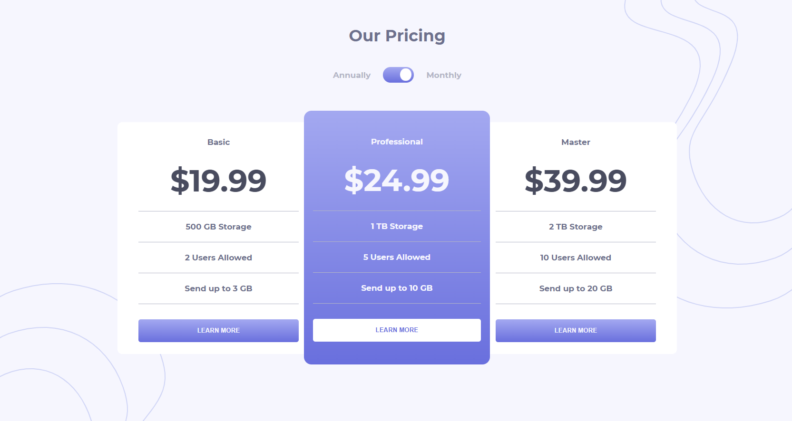

# Frontend Mentor - Pricing component with toggle solution

This is a solution to the [Pricing component with toggle challenge on Frontend Mentor](https://www.frontendmentor.io/challenges/pricing-component-with-toggle-8vPwRMIC). Frontend Mentor challenges help you improve your coding skills by building realistic projects.

## Table of contents

-   [Overview](#overview)
    -   [The challenge](#the-challenge)
    -   [Screenshot](#screenshot)
    -   [Links](#links)
    -   [Built with](#built-with)
    -   [Useful resources](#useful-resources)
-   [Author](#author)
-   [Acknowledgments](#acknowledgments)

**Note: Delete this note and update the table of contents based on what sections you keep.**

## Overview

### The challenge

Users should be able to:

-   View the optimal layout for the component depending on their device's screen size
-   Control the toggle with both their mouse/trackpad and their keyboard

### Screenshot

### Links

-   Solution URL: [Add solution URL here](https://www.frontendmentor.io/challenges/pricing-component-with-toggle-8vPwRMIC/hub/frontend-mentor-pricing-component-with-toggle-OJyEPJ4Vd)
-   Live Site URL: [Add live site URL here](https://vibrant-heyrovsky-283a9c.netlify.app/)

### Built with

-   Semantic HTML5 markup
-   CSS custom properties
-   Flexbox

### Useful resources

-   [Mozilla](https://developer.mozilla.org/en-US/docs/Web/API/KeyboardEvent/keyCode) - This helped me for getting the code for the key.

## Author

-   Frontend Mentor - [@leandromendes25](https://www.frontendmentor.io/profile/leandromendes25)
